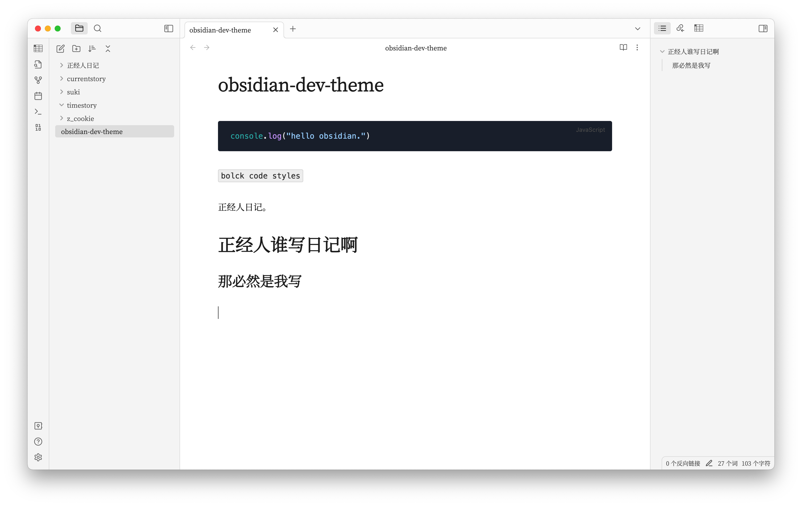

# obsidian dev theme

obsidian update version 1.0（2022/10/14）.

personally, the refactored theme is beautiful and there is almost no need to change the theme.

but I actually like the imitation song and dark code block, so I wrote some style snippets replace it.

> How to use ?
>
> 1. Editor/Appearance/CSS snippets
> 2. add obsidian-dev.css and enable
